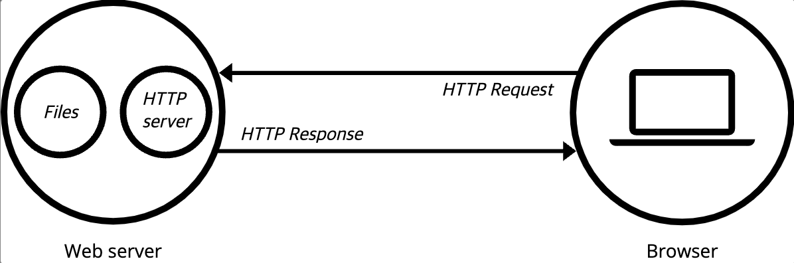
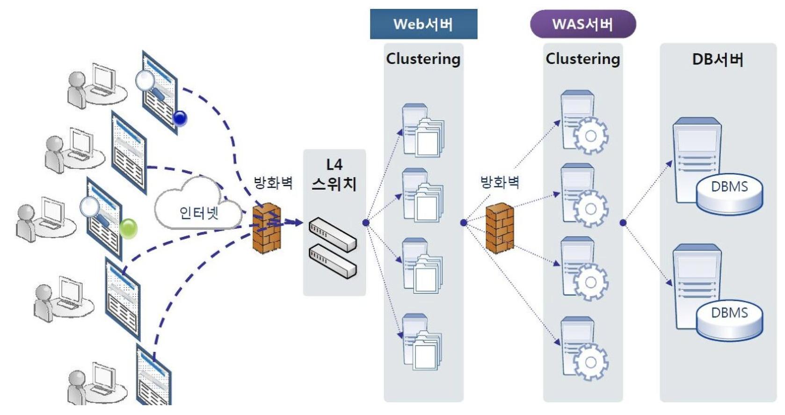

# Web server

## 의미
* HTTP 요청에 대해 응답하고, 요청에 따른 웹 사이트(페이지) 서비스를 제공하는 컴퓨터 (하드웨어 or 소프트웨어 or 둘 다)
* 하드웨어 측면 : 웹 서버의 소프트웨어와 website의 컴포넌트 파일들을 저장하는 컴퓨터(컴포넌트 파일에는 HTM, images, CSS, JS files 등이 있음)
* 소프트웨어 측면 : 웹 사용자가 호스트 파일에 접근하여 요청할 때, 그것에 대해 반응/응답 해줌
* 웹서버는 대부분 HTTP로 운영되기 때문에 HTTP 서버라고 불리기도 함
* 좁은 의미로는 정적페이지를 반환해주는 역할을 하는 서버를 의미하기도 하고, 넓은 의미로는 HTTP 응답을 위해 동작하는 서버집합을 의미하기도 함
* 좁은 의미로 사용될 때, 동적 페이지는 WAS(Web Application Server)에게 요청을 넘기고 WAS가 처리함

## 간단한 웹서버 구조

    [[그림 출처]](https://developer.mozilla.org/ko/docs/Learn/Common_questions/Web_mechanics/What_is_a_web_server)
1. 요청을 받음
2. 요청에 따라 서버가 관리하는 file을 생성, 읽기, 수정, 삭제
3. 처리한 결과를 클라이언트에게 반환(응답)해줌

## 복잡한 웹서버 구조

[[그림 출처]](https://waspro.tistory.com/331)
1. L4 스위치 (또는 로드밸런서) : 비교적 한가한 서버에 요청을 할당함
2. Web서버 : 간단한 요청(정적 페이지 등)에 대해 응답하고, 동적 요청에 대해서는 WAS에 토스함
3. WAS서버 : 복잡한 요청(동적 페이지 등)에 대해 처리함. 이때 DB에 접근하여 정보를 주고받을 수 있음

## 참고문헌
* [MDN Web docs](https://developer.mozilla.org/ko/docs/Learn/Common_questions/Web_mechanics/What_is_a_web_server)
* [waspro blog](https://waspro.tistory.com/331)
* 추가자료 : [Web server와 WAS의 차이](https://gmlwjd9405.github.io/2018/10/27/webserver-vs-was.html)
