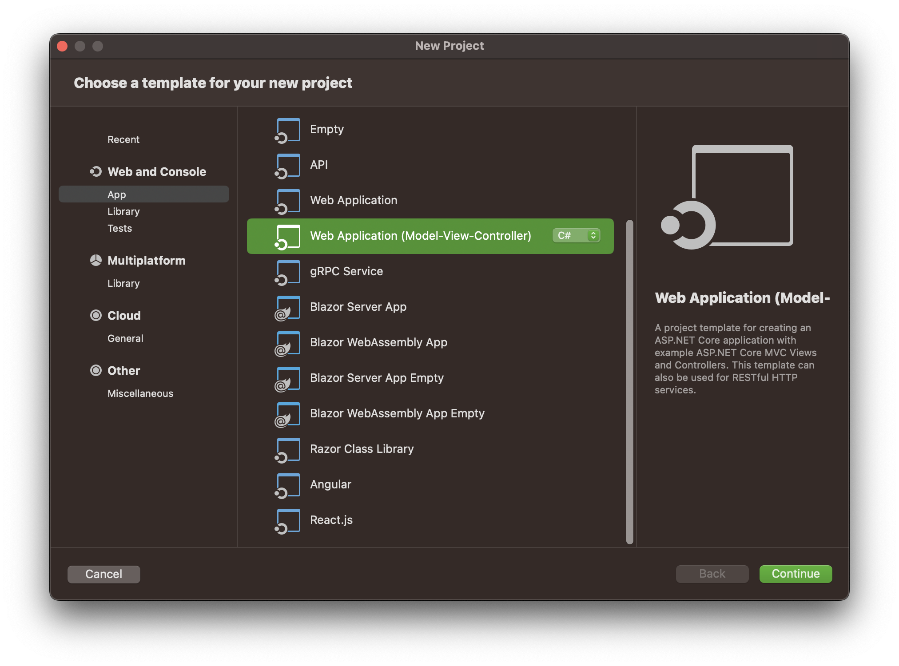
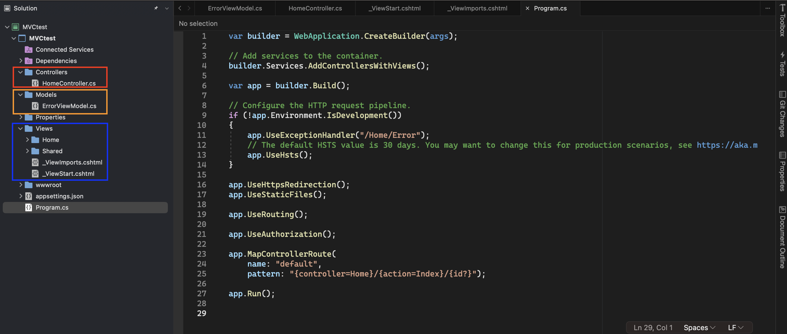

# MVC

## 의미

* 데이터(Model) - 사용자 인터페이스(View) - 논리제어(Controller) 로 나눈 소프트웨어 디자인 패턴
* ASP.NET Core 에서도 MVC 방식의 프레임워크를 지원함

## Model

* 앱이 포함해야할 데이터가 무엇인지를 정의함. 데이터를 처리하고 저장하며, 이를 컨트롤러나 뷰에서 사용할 수 있는 형태로 변환함
* 데이터베이스에 저장되어있고, 그 데이터를 꺼내와서 Model을 구성하는 방식이 많이 쓰임
* 자신의 상태에 변화가 있을 때 컨트롤러와 뷰에 전달함(또는 컨트롤러와 뷰가 가져감)

## View

* 사용자 인터페이스를 정의함
* 표시할 데이터를 model로 부터 받아서, 데이터를 사용자에게 보여줌. 사용자의 입력을 받는 인터페이스도 구현함
* 사용자에게 보여지는 화면 자체에 대한 구현을 의미함

## Controller

* 모델과 뷰를 연결하고, 사용자 입력에 대한 응답으로 모델/뷰를 업데이트하는 로직을 정의함
* 모델에 명령을 보냄으로써 모델의 상태를 변경할 수 있고, 뷰에 명령을 보냄으로써 모델의 표시 방법을 바꿀 수 있음

## 예시

앱 사용자가 물품을 장바구니에 추가할 때

1. 사용자는 View가 만든 장바구니 추가 버튼 클릭
2. Controller가 Model에게 사용자의 장바구니 목록에 업데이트가 필요함을 알림
3. Model은 Controller의 안내대로 데이터를 업데이트함
4. View가 다시 업데이트 된 데이터를 갖고 사용자 인터페이스를 구성하여 사용자에게 보여줌

## 장점

* 로직과 UI를 분리하여 유지보수성, 확장성, 테스트 용이성을 높일 수 있음
* 여러 개발자가 동시에 개발을 할 때, 모델, 뷰, 컨트롤러를 분리함으로써 개발의 복잡성을 줄이고 각자의 역할에 집중할 수 있음

## ASP.NET Core에서의 MVP

### 생성

* 생성시 기본 프레임워크를 지원함

&#x20;

<figure><figcaption></figcaption></figure>

* Model, View, Controller 각각 디렉토리가 생성되어 있고 연결되어 있음&#x20;

<figure><figcaption></figcaption></figure>

* 각 영역에서 구성요소로 구현함
* 이를 연결하기 위해 라우팅(Routing)과 컨트롤러 액션(Controller Action) 메서드를 사용함

> 라우팅(Routing)과 컨트롤러 액션(Controller Action)에 대한 자세한 설명은 해당 페이지 참고

## 참고문헌

* [MDN Web docs](https://developer.mozilla.org/ko/docs/Glossary/MVC)
* [위키피디아](https://ko.wikipedia.org/wiki/%EB%AA%A8%EB%8D%B8-%EB%B7%B0-%EC%BB%A8%ED%8A%B8%EB%A1%A4%EB%9F%AC)
