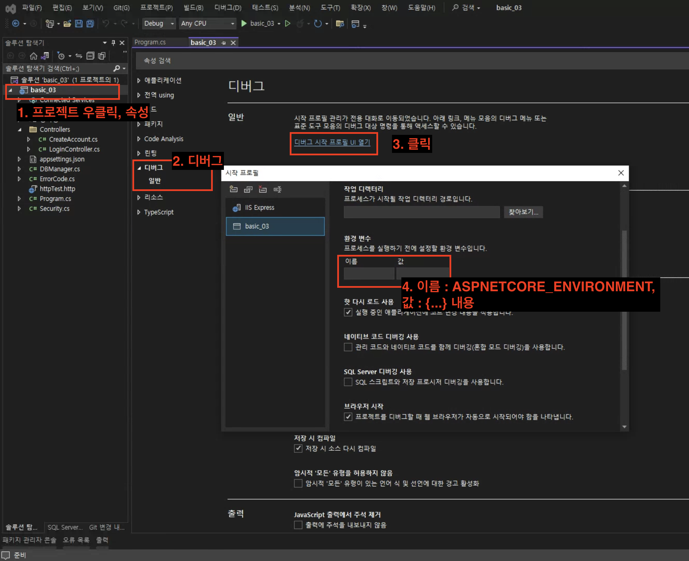

# Configure

## 의미

* 애플리케이션에서 환경설정 값(환경변수)들로 사용하고 싶은 것들을 JSON 형태로 저장해놓고, 그 파일의 내용을 프로그램 안으로 데이터화해서 가져오는 것
* 환경변수 모음이라고 볼 수 있을 듯
* docker-compose의 .ENV file 과 유사한 역할

## 사용

### 값 저장

* 원하는 내용을 appsetting.{Environment}.json 파일에 json 형식에 맞춰서 프로젝트의 루트 경로에 저장하면 됨 (기본적으로 appsetting.json 파일이 만들어져 있음)
* ApplicationBuilder로 .Build()하면, app.Configuration에 appsetting.json 파일의 데이터가 저장돼있음

### 프로그램 안에 데이터 넣기

*   `IConfiguration`이라는 인터페이스로 받아서 사용할 수 있음

    ```C#
    var app = builder.Build();
    IConfiguration configuration = app.Configuration; // 이 안에 데이터가 담겨있고, 꺼내서 쓸 수 있음
    ```

    (appsetting.json 덩어리가 됨)
*   프로그램이 빌드될 때, 원하는 appsetting.{Environment}.json파일 설정하는 방법&#x20;

    <figure><figcaption></figcaption></figure>

    * IHostingEnvironment.EnvironmentName 의 값을 참조한다고 함(using Microsoft.Extensions.Hosting)

### 원하는 값 불러오기

* key = value 쌍으로 참조할 수 있으며, 레이어는 콜론 ':' 을 통해 들어갈 수 있음
*   Configuration\["key"] -> 해당하는 value가 리턴됨

    ```JSON
    // JSON
    {
        "Position": {
            "Title": "Editor",
            "Name": "Joe Smith"
        },
        "MyKey": "My appsettings.json Value",
        "Logging": {
            "LogLevel": {
                "Default": "Information",
                "Microsoft": "Warning",
                "Microsoft.Hosting.Lifetime": "Information"
            }
        },
        "AllowedHosts": "*"
    }
    ```

    ```C#
    // C#
    var builder = WebApplication.CreateBuilder(args);
    var app = builder.Build(); // Build()하면 내부적으로 Configuration도 알아서 가져옴
    IConfiguration Configuration = app.Configuration;

    var myKeyValue = Configuration["MyKey"]; // "My appsettings.json Value"
    var title = Configuration["Position:Title"]; // "Editor"
    var name = Configuration["Position:Name"]; // "Joe Smith"
    var defaultLogLevel = Configuration["Logging:LogLevel:Default"]; // "Information"
    ```

## 참고문헌

* [MS Docs](https://learn.microsoft.com/en-us/aspnet/core/fundamentals/configuration/?view=aspnetcore-7.0)
