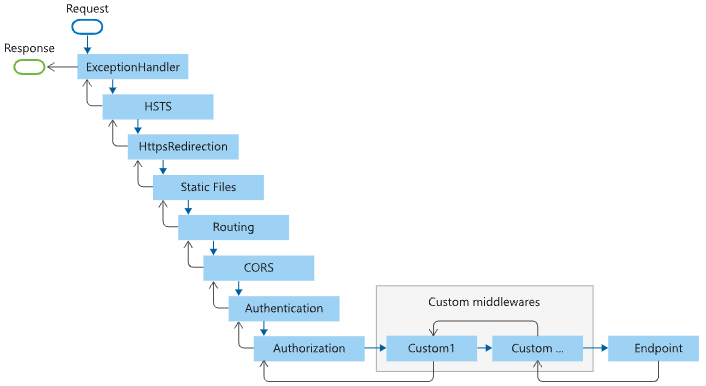

# Middleware (미들웨어)

## 일반적 의미의 미들웨어
### 의미
* 양 쪽을 연결하여 데이터를 주고 받을 수 있도록 <b>중간에서 매개 역할</b>을 하는 소프트웨어
* 서로 다른 애플리케이션이 서로 통신하는데 사용되는 소프트웨어
* 단일 시스템에 접근할 수 있게 다양한 기술, 도구, 데이터베이스 등 간의 다리 역할을 함
### 이점
* 표준화된 인터페이스 제공 가능
* 다양한 환경에서 운영 가능 (체계가 다른 업무와 상호 연동 가능)
* 분산도니 업무를 동시에 처리 가능하여 자료의 일관성 유지
* 부하 분산 가능

## ASP.NET Core에서의 미들웨어
### 의미
* HTTP 요청을 처리하는 파이프라인(pipeline)에서의 중간 단계
* 요청을 받아들이고 응답을 생성하기 전에 추가적인 <b>중간 작업을 수행</b>하는 소프트웨어 컴포넌트
* ASP.NET Core에서 미들웨어는 `IApplicationBuilder` 인터페이스의 `Use()`, `Use{Feature}` 메서드를 사용하여 파이프라인에 추가함
* 컴포넌트(Componenet) : 미들웨어 구성요소  중 하나(미들웨어는 컴포넌트의 집합). 요청을 처리할 때 각 단계
* program.cs에서 미들웨어를 설정해주면 됨. 이전 버전(.NET 3.x)에서는 setup.cs 파일의 Configure 에서 설정했었음
* 사용예시
    ```C#
    var app = builder.Build();
    app.UseRouting(); // 이렇게 사용함
    ```

## 동작 원리
* 요청을 처리하는 파이프라인은 일련의 미들웨어(컴포넌트)로 구성되어 있음. 여러 컴포넌트를 연속적으로 구성하고 조립하는 구조
* 미들웨어는 연속된 순서대로 작업을 수행함
* 각 컴포넌트는 작업을 수행하는데, 작업 결과에 따라 받은 요청을 다음 파이프라인으로 넘길지 말지를 결정함

## 동작 순서
* program.cs 에 app.Use{Feature} 로 등록되는 순서에 따라 동작함. 순서에 따라 미들웨어의 동작이 다를 수 있으므로 주의해야 함
### WebApplication 에서의 미들웨어 파이프라인

* 실행 스레드는 검은색 화살표를 따라 실행되며, 때로는 작업 스레드가 해당 미들웨어(컴포넌트)를 실행함
* 미들웨어가 순차적으로 실행되고, endpoint 미들웨어까지 갔다가 결과 값을 받고 다시 역순으로 올라옴
* 중간에 예외 등 어떤 이벤트가 있으면 endpoint까지 안가고 미들웨어에서 돌다가 다시 올라올 수 있고, 처리 후에 다시 endpoint로 갈 수도 있음 (설정해주기 나름)
### MVC, Razor Pages앱의 미들웨어 순서

* 기본적으로 위 그림과 같은 순서를 따라 미들웨어가 실행됨
* 사용자가 원하는 대로 순서를 바꾸거나 사용자 지정 미들웨어 주입 가능
* 각 단계별 메소드명과 설명은 [MS Docs](https://learn.microsoft.com/ko-kr/aspnet/core/fundamentals/middleware/?view=aspnetcore-7.0#middleware-order)에서 확인 가능

## 미들웨어 제어 종류 / 확장
### Use()
* 요청 파이프라인에서 순서대로 적용되며, 중간 처리 작업을 수행함. 다음 미들웨어에게 제어를 전달하기 전에 요청 및 응답을 변경할 수 있음
### Run()
* 파이프라인에서 마지막 미들웨어로 실행되며, 다음 미들웨어에게 제어를 전달하지 않음. 응답을 생성하고 요청을 완전히 처리해야함
### Map() 
* 미들웨어의 분기를 URL 경로에 따라 나눔. 이를 통해 각각 다른 미들웨어를 적용하여 서로 다른 기능을 처리할 수 있습니다.
### 기본제공 미들웨어
[MS Docs 참고](https://learn.microsoft.com/ko-kr/aspnet/core/fundamentals/middleware/?view=aspnetcore-7.0#built-in-middleware)

## 참고문헌
- [MS Docs](https://learn.microsoft.com/ko-kr/aspnet/core/fundamentals/middleware/?view=aspnetcore-7.0)