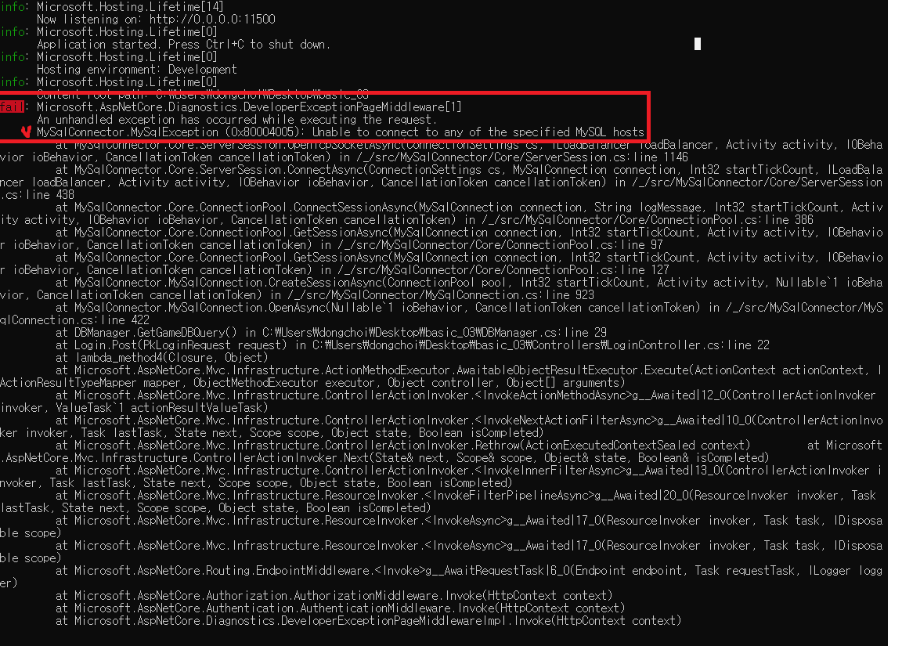

# basic03

## 개관
> MySQL과 Redis를 사용하여 계정 생성과 로그인 처리를 합니다.  
> 라이브러리: MySQL(Sqlkata), Redis(CloudStructures)  
* MySql 스키마
```sql
CREATE TABLE IF NOT EXISTS account_db.`account`
(
    AccountId BIGINT NOT NULL AUTO_INCREMENT PRIMARY KEY COMMENT '계정번호',
    Email VARCHAR(50) NOT NULL UNIQUE COMMENT '이메일',
    SaltValue VARCHAR(100) NOT NULL COMMENT  '암호화 값',
    HashedPassword VARCHAR(100) NOT NULL COMMENT '해싱된 비밀번호',
    CreatedAt DATETIME DEFAULT CURRENT_TIMESTAMP COMMENT '생성 날짜'
)
```
* 

## Porgram.cs
1. 빌더 생성

    `var builder = WebApplication.CreateBuilder(args);`

2. 미들웨어-컨트롤러 추가

    `builder.Services.AddControllers();`

3. app 생성

    `var app = builder.Build();`

4. 서비스 추가-Routing

    `app.UseRouting();`

5. 서비스 추가-Endpoints 사용(MapControllers)

    `app.UseEndpoints(endpoints => { endpoints.MapControllers(); });`

6. DBManager 초기화
    * config 파일에서 데이터베이스에 대한 정보를 가져옴

    `IConfiguration configuration = app.Configuration;
    DBManager.Init(configuration);`
7. app 실행

    `app.Run(configuration["ServerAddress"]);`
    * app.Run()의 매개변수로 hostIp:port 넣으면 그거로 listen하게 됨

## LoginController.cs
### Request POST /login 에 대한 처리
1. 응답할 인스턴스 생성 (이후 로직에서 상황에 맞게 값 설정)
    
    `var response = new PkLoginResponse();
     response.Result = ErrorCode.None;`
    
2. SqlKata.QueryFactory의 생명주기 블록을 만들어줌
    
    `using (var db = await DBManager.GetGameDBQuery()) { ... 3번 과정 ... }`
    
3. 2번의 using블록 안에서 QueryFactory를 통해 user info 가져와서 유효성 확인하기 (Authentication(인증))
    
    ```csharp
    // parm : PkLoginRequest request
    using (var db = await DBManager.GetGameDBQuery())
    {
    	// user 정보를 db에서 가져오기
    	var userInfo = await db.Query("account").Where("Email", request.Email).FirstOrDefaultAsync<DBUserInfo>();
    	
    	// db 에서 갖고 온 정보에 로그인에 필요한 내용이 존재하는지 확인
      if (userInfo == null || string.IsNullOrEmpty(userInfo.HashedPassword))
      {
          response.Result = ErrorCode.Login_Fail_NotUser;
          return response;
      }
      
      // 유저가 입력한 password를 hash 값으로 바꿈
      var hashingPassword = Security.MakeHashingPassWord(userInfo.SaltValue, request.Password);
    
    	// 비밀번호 체크. 유효하지 않으면 에러 반환
      Console.WriteLine($"[Request Login] Email:{request.Email}, request.Password:{request.Password},  saltValue:{userInfo.SaltValue}, hashingPassword:{hashingPassword}");
      if (userInfo.HashedPassword != hashingPassword)
      {
          response.Result = ErrorCode.Login_Fail_PW;
          return response;
      }
    
    	// 가져온 db 정보 놓아주기 (할당 해제)
      db.Dispose();
    }
    ```
    
4. 유효한 사용자라고 판단 됐으면, 토큰 발급하기
    
    ```csharp
    string tokenValue = Security.CreateAuthToken();
    var idDefaultExpiry = TimeSpan.FromDays(1);
    ```
    
5. 사용자에게 줄 토큰 정보 redis에 넣기
    
    ```csharp
    var redisId = new RedisString<string>(DBManager.RedisConn, request.Email, idDefaultExpiry);
    await redisId.SetAsync(tokenValue);
    ```
    * 이후에 클라이언트가 데이터 요청시 이 토큰 정보를 서버에게 보낼 것이며, 서버는 이 토클을 Redis에 있는지 확인하여 사용자 인증 및 권한을 확인 할 수 있음
    
6. 사용자에게 토큰 보내주기
    
    ```csharp
    response.Authtoken = tokenValue;
    return response;
    ```
    

## CreateAccount.cs
### Request POST /CreateAccount 에 대한 처리
1. 응답할 인스턴스 생성 (이후 로직에서 상황에 맞게 값 설정)
    
    ```csharp
    var response = new PkCreateAccountResponse {Result = ErrorCode.None};
    ```
    
2. 비밀번호를 저장할 hash 값 만들기
    
    ```csharp
    var saltValue = Security.SaltString();
    var hashingPassword = Security.MakeHashingPassWord(saltValue, request.Password);
    ```
    
3. SqlKata.QueryFactory의 생명주기 블록을 만들어줌
    
    ```csharp
    using (var db = await DBManager.GetGameDBQuery()) { ... 4번과정 ... }
    ```
    
4. db에 새로운 계정 정보 등록(insert)
    
    ```csharp
    try
    {
    		// db 에 계정정보 insert : Async(비동기)방식으로 넣음
        var count = await db.Query("account").InsertAsync(new
        {
            Email = request.Email,
            SaltValue = saltValue,
            HashedPassword = hashingPassword
        });
    
    		// 위의 insert가 실패 했을 경우. DB에서 Email의 constraint를 중복 불가로 설정
        if (count != 1)
        {
            response.Result = ErrorCode.Create_Account_Fail_Duplicate;
        }
    
        Console.WriteLine($"[Request CreateAccount] Email:{request.Email}, saltValue:{saltValue}, hashingPassword:{hashingPassword}");
    }
    // QueryFactory 에서 에러 발생
    catch(Exception ex)
    {
        Console.WriteLine(ex.ToString());
        response.Result = ErrorCode.Create_Account_Fail_Exception;
        return response;
    }
    // 가져온 db 정보 놓아주기 (할당 해제)
    finally
    {
        db.Dispose();
    }
    ```
    
    - 왜 try-catch로? db연결 실패 or QueryFactory 기능 실패의 경우를 대비한건가?
5. 응답 반환
    
    ```csharp
    return response;
    ```
    

## Security.cs

* 보안, 암호화 관련된 작업을 위한 메소드 구현
    
    `private const String AllowableCharacters = "abcdefghijklmnopqrstuvwxyz0123456789";`
    
1. 패스워드 해싱 적용
    
    ```csharp
    public static String MakeHashingPassWord(String saltValue, String pw)
    {
        var sha = SHA256.Create();
        var hash = sha.ComputeHash(Encoding.ASCII.GetBytes(saltValue + pw));
        var stringBuilder = new StringBuilder();
        foreach (var b in hash)
        {
            stringBuilder.AppendFormat("{0:x2}", b);
        }
    
        return stringBuilder.ToString();
    }
    ```
    
2. 해싱을 위한 암호 키 생성
    
    ```csharp
    public static String SaltString()
    {
        var bytes = new Byte[64];
        using (var random = RandomNumberGenerator.Create())
        {
            random.GetBytes(bytes);
        }
    
        return new String(bytes.Select(x => AllowableCharacters[x % AllowableCharacters.Length]).ToArray());
    }
    ```
    
3. 인증 토큰 생성
    
    ```csharp
    public static String CreateAuthToken()
    {
        var bytes = new Byte[25];
        using (var random = RandomNumberGenerator.Create())
        {
            random.GetBytes(bytes);
        }
    
        return new String(bytes.Select(x => AllowableCharacters[x % AllowableCharacters.Length]).ToArray());
    }
    ```
    

## DBManager.cs

1. 연결할 DB server 들에 대한 ip/port 정보 등을 갖고 있음
    
    ```csharp
    static string GameDBConnectString;
    static string RedisAddress;
    
    public static RedisConnection RedisConn { get; set; }
    
    public static void Init(IConfiguration configuration)
    {
        GameDBConnectString = configuration.GetSection("DBConnection")["MySqlGame"];
        RedisAddress = configuration.GetSection("DBConnection")["Redis"];
        
        var config = new RedisConfig("basic", RedisAddress);
        RedisConn = new RedisConnection(config);
    }
    ```
    
2. QueryFactory를 반환하는 함수 제공
    
    ```csharp
    public static async Task<QueryFactory> GetGameDBQuery()
    {
        var connection = new MySqlConnection(GameDBConnectString);
        await connection.OpenAsync();
        
        var compiler = new SqlKata.Compilers.MySqlCompiler();
        var queryFactory = new SqlKata.Execution.QueryFactory(connection, compiler);
        
        return queryFactory;
    }
    ```

## 빌드는 돼는데, API에 제대로 응답 못함
* 예제 코드일 뿐, 아직 DB server랑 연결되어 있지 않음
