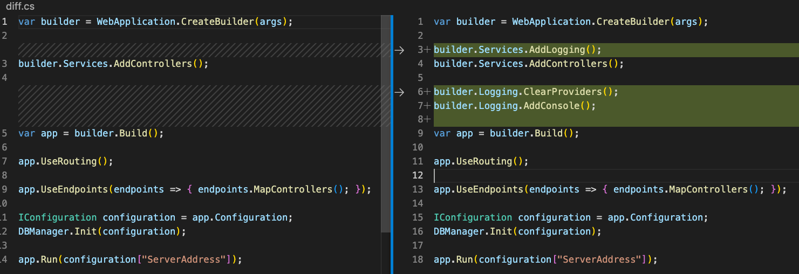
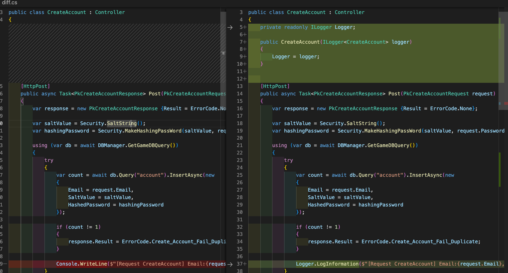
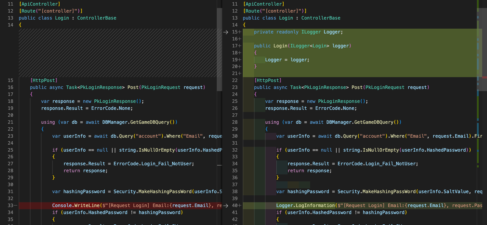

# basic04

> 파일별로 각 코드가 무엇을 구현하고 있는지에 대해 정리하였습니다. 
> basic03에서 logging 부분이 추가되었습니다. logging에 대한 이해가 필요하시면 [관련 게시글](../NETCore/Logging.md)을 참고해주세요

## Program.cs

1. 로깅 서비스 추가

    `builder.Services.AddLogging()`

2. 로깅에 설정돼어있는 제공자(Provider) 초기화/제거

    `builder.Logging.ClearProviders();`

3. 로깅에 Console 제공자(Provider) 추가

    `builder.Logging.AddConsole();`

## LoginController.cs & CreateAccount.cs
* Console.WriteLine()로 출력하는 대신 Logging 기능 사용

