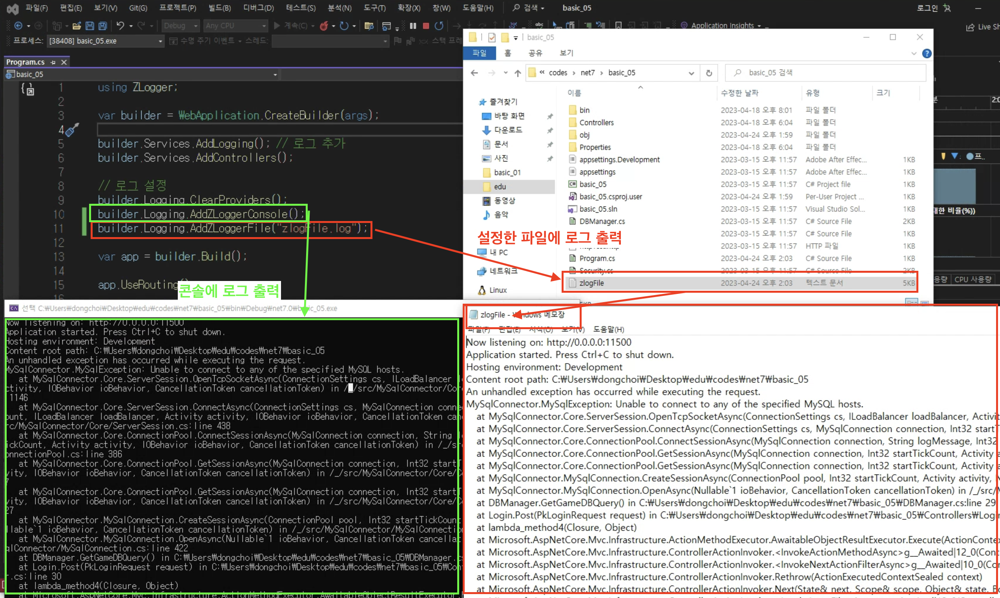

# basic05

> basic_04에서 로거를 표준에서 ZLogger로 변경되었습니다.
> ZLogger에 대한 설명은 교육에서 제공해주신 [학습 > 05_ZLogger.md]에 매우 잘 정리되어있습니다. 자세한 내용은 [해당 자료](./basic05_05_ZLogger.md)를 살펴보시는 것들 권합니다.

## ZLogger란?
* 로깅을 위한 확장(extension) 라이브러리
* 표준 라이브러리의 Logger나 Console.Write()보다 더 가볍게 만들어져서 애플리케이션의 부하를 줄일 수 있음
* 로그 출력을 파일에 해줄 수 있으며, 파일 이름도 동적으로 생성하여 만들어 줄 수 있음
* Nuget에서 ZLogger를 다운받을 수 있음
    ``` C#
    // program.cs에서 logging 설정
    using Zlogger;
    var builder = WebApplication.CreateBuilder(args);

    // 기본 제공자를 재정의해준다.
    builder.logging.ClearProviders();
    
    // optional(MS.E.Logging): default값은 Info이며 option을 바꿔 최소 로그레벨을 지정해 줄 수 있다.
    builder.logging.SetMinimumLevel(LogLevel.Debug);
    
    // 콘솔에 출력한다.
    builder.logging.AddZLoggerConsole();

    // 지정된 파일에 출력한다.
    builder.logging.AddZLoggerFile("fileName.log");

    // 날짜-시간 또는 파일 크기에 따라 출력 파일 경로를 변경한다.
    builder.logging.AddZLoggerRollingFile((dt, x) => $"logs/{dt.ToLocalTime():yyyy-MM-dd}_{x:000}.log", x => x.ToLocalTime().Date, 1024);
    
    // 구조화된 로깅 지원
    builder.logging.AddZLoggerConsole(options =>
    {
        options.EnableStructuredLogging = true;
    });
    ```

## ZLogger 사용 테스트

* program.cs에 로거 출력 추가
* AddZLoggerConsole()은 콘솔에 출력해주고, AddZLoggerFile("파일명")은 파일에 출력해줌
