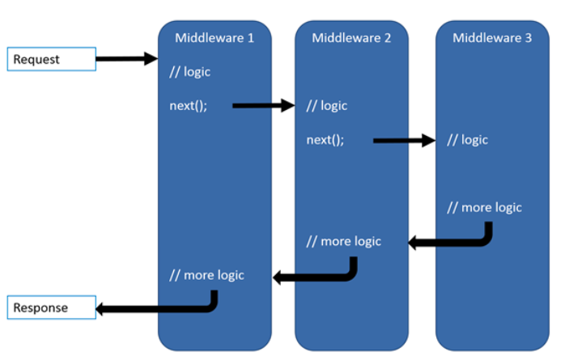

# basic06

> [사용자 지정 미들웨어](https://learn.microsoft.com/ko-kr/aspnet/core/fundamentals/middleware/write?view=aspnetcore-7.0)의 사용 방법에 대한 예제 코드입니다. 미들웨어는 등록한 순서대로 실행되기에, program.cs에서 순서를 잘 지정해야 합니다.

## program.cs
* Routing과 Endpoint(Controller) 사이에 두 가지 미들웨어가 삽입되어, 삽입된 순서대로 실행됨
* 사용자 지정 미들웨어는 [MiddlerWare] 디렉토리 안에 정의되어있음
    ``` C#
    // program.cs
    app.UseRouting();

    app.UseLoadRequestDataMiddlerWare();
    app.UseCheckUserSessionMiddleWare();

    app.UseEndpoints(endpoints => { endpoints.MapControllers(); });
    ```

## LoadRequestDataMiddlerWare.cs
* 미들웨어는 클래스로 정의되어야 하고 다음과 같은 요소를 가지고 있어야 함
1. 프레임워크에서 해당 미들웨어 실행 후 다음 미들웨어가 동작할 수 있게 하기 위해서 대리자(delegate)를 설정해줘야 함
    ``` C#
    private readonly RequestDelegate _next;

    public LoadRequestDataMiddlerWare(RequestDelegate next)
    {
        _next = next;
    }
    ```
2. 미들웨어가 실행되는 코드는 Invoke 또는 InvokeAsync라는 공용 메서드에 정의 되어야 함
    * basic06의 경우 `public async Task InvokeAsync(HttpContext context)` 로 정의 및 구현 되어 있음
    * 비동기식으로 구현하기 위해서는 InvokeAsync를 구현해야 함
    * 이 메서드는 Task를 반환해야 함
    * 적절한 시점에 awit로 `_next(context)`를 호출하여 다음 미들웨서 실행
3. CheckUserSessionMiddleWare.cs, LoggingMiddleware.cs도 이와 같은 구조
4. `_next(context)`를 호출
    * 미들웨어 메서드 내부에서 _next 미들웨어 메서드를 호출하기 때문에 아래 그림과 같은 구조로 실행된다고 볼 수 있음
    ``` text
    1. Middleware1 메소드 안에서 `await _next(context)`으로 Middleware2 메소드 호출. 
    2. Middleware2 메소드 안에서 또 `await _next(context)` Middleware3 메소드 호출.
    3. Middleware 메소드에서 계속해서 next Middleware 메소드를 호출함
    4. EndPoint Middleware(next가 없는 마지막 미들웨어)에서는 void 또는 어떤 값을 리턴하면서 종료.
    5. 이전 메소드에서 `await _next(context)`의 다음 줄 코드부터 이어서 계속 진행하다가 void 또는 어떤 값을 리턴하면서 종료.
    6. 끝까지 돌아와서 프레임워크 내부에서 동작하는 객체가 Response를 보냄
    ```
    

## MiddlewareExtentions.cs
1. 확장 메서드 추가하기
    * 아래 코드를 추가했기 때문에, program.cs에서 app.UseLoadRequestData(), app.UseCheckUserSessionMiddleWare()를 사용할 수 있음;
    ``` C#
    public static class MiddlewareExtentions
    {           
        public static IApplicationBuilder UseLoadRequestDataMiddlerWare(this IApplicationBuilder builder)
        {
            return builder.UseMiddleware<LoadRequestDataMiddlerWare>();
        }

        public static IApplicationBuilder UseCheckUserSessionMiddleWare(this IApplicationBuilder builder)
        {
            return builder.UseMiddleware<CheckUserSessionMiddleWare>();
        }  
    }
    ```
2. LoggingMiddlewareExtensions.cs도 이와 같은 구조