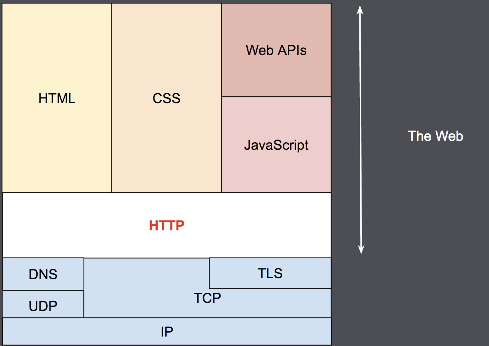

# HTTP란

## 의미

* 웹에서 주로 쓰이는 정보를 주고 받을 수 있는 프로토콜
* 주로 TCP 위에서 사용하고 있으며 HTTP/3 부터는 UDP를 사용함
* 1.1 버전을 많이 사용하고 있으며, 2버전에서 여러 기능들이 추가돼서 최근의 웹서버에서는 2버전도 지원하는 경우가 있음. 단, 호환성 측면 때문에 1.1버전이 가장 일반적으로 쓰이고 있음
* 80번 포트를 주로 사용하고, HTTPS는 443번 포트를 주로 사용함
* 어플리케이션과 어플리케이션이 정보를 주고 받을 때, **어떤 규칙을 가진 문자열**이라고 생각하면 됨

## HTTPS

* HTTP에서 보안적인 요소(TLS)가 추가된 프로토콜
* 443번 포트를 주로 사용함

## 아키텍처

<figure><figcaption></figcaption></figure>

&#x20;[그림출처 : MDN](https://developer.mozilla.org/en-US/docs/Web/HTTP/Overview)

* HTTP는 IP위의 TCP(HTTP/3에서는 UDP)에서 동작함
* HTTP의 body에 HTML, CSS, Web API, JS, file 등을 담아서 정보를 주고 받을 수 있음

## 특징

* **Stateless** : 서버는 클라이언트의 상태 정보를 유지하지 않음. 클라이언트의 이전 요청과 현재 요청이 서로 독립적으로 처리됨. 어떤 상황에서는 이를 보완하기 위해서, 캐시나 토큰 등을 이용하여 서버가 클라이언트에 대한 정보를 확인함
* **Connectionless** : 클라이언트와 서버는 요청과 응답 후에 연결을 끊음. 지속적인 요청이 있을 때의 연결을 맺고 끊는 비용을 줄이기 위해서, 1.1 버전에서는 keep-alive를 상태로 일정 시간 연결을 지속함.
* **무분별한 요청의 가능성** : HTTP는 무분별한 요청을 보낼 수 있음. 따라서, 서버는 이를 방지하기 위해 IP주소, 쿠키 등을 이용하여 클라이언트의 무분별한 요청을 차단함(이를 이용해 DDoS 공격을 함)

## 참고문헌

* [HTTP 완벽가이드](http://www.yes24.com/Product/Goods/15381085)
* [MDN web docs](https://developer.mozilla.org/en-US/docs/Web/HTTP/Overview)
* [위키피디아](https://ko.wikipedia.org/wiki/HTTP)
